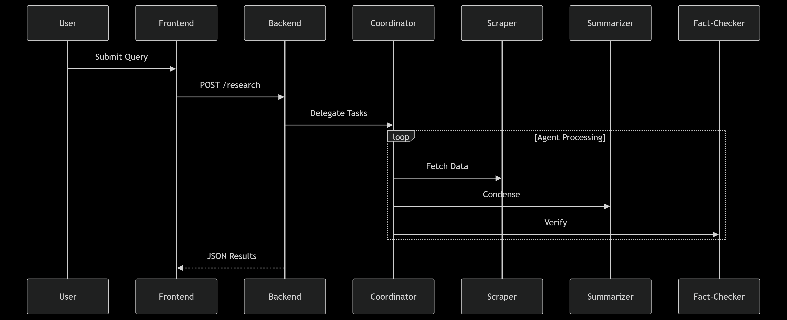
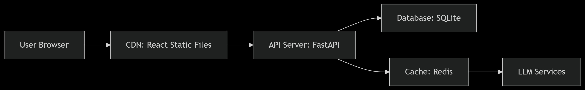

# 🤖🔍 AI Research Assistant System

## Overview
A **multi-agent AI system** that automates academic research by coordinating 7 specialized agents to gather, analyze, and summarize information from diverse sources.

## 🏗 System Architecture

```mermaid
graph TD
    A[User] -->|Research Query| B[React Frontend]
    B -->|HTTP Request| C[FastAPI Backend]
    C --> D[Coordinator Agent]
    
    D --> E[Web Scraper Agent]
    E --> F[(Web/APIs)]
    E --> G[(PDFs)]
    
    D --> H[Summarizer Agent]
    H --> I[LLM (Ollama/OpenAI)]
    
    D --> J[Fact-Checker Agent]
    J --> K[(WolframAlpha)]
    
    D --> L[Translation Agent]
    L --> M[(LibreTranslate)]
    
    D --> N[Sentiment Analyzer]
    N --> O[[HuggingFace]]
    
    D --> P[Citation Formatter]
    
    subgraph Legend
        X[Agent] -.-> Y[[External Service]]
        X --> Z[(Data Source)]
    end



## ✨ Key Features
- **7-Agent Workflow**: Coordinator, Scraper, Summarizer, Fact-Checker, Translator, Visualizer, Synthesizer  
- **LangGraph Orchestration**: Manages multi-agent flow  
- **Tool Integrations**: Web search, PDF parsing, translation, sentiment analysis  
- **Interactive Visualization**: Real-time tracking of agent collaboration  
- **Free/Paid Options**: Supports both local (Ollama) and cloud (OpenAI) LLMs  

## 🛠 Tech Stack

| Component | Technologies |
|-----------|--------------|
| Backend   | FastAPI, LangChain, LangGraph |
| Frontend  | React, Tailwind CSS |
| ML/NLP    | Transformers, OpenAI/Local LLMs |
| Tools     | SerpAPI, arXiv API, PyPDF2 |

---

## 📦 Installation Guide

### 🔧 Prerequisites
- Python 3.9 or higher
- Node.js 18+ and npm
- (Optional) Ollama or OpenAI API Key

### 🐍 Backend Setup (FastAPI + LangGraph)

1. Clone the repository:

```bash
git clone https://github.com/Addisu-Taye/ai-research-assistant.git
cd ai-research-assistant/backend
```

2. Create a virtual environment and activate it:

```bash
python -m venv venv
source venv/bin/activate   # On Windows: venv\Scripts\activate
```

3. Install dependencies:

```bash
pip install -r requirements.txt
```

4. Run the FastAPI server:

```bash
uvicorn app:app --reload --port 8000
```

### 🌐 Frontend Setup (React + Tailwind)

```bash
cd ../frontend
npm install
npm start
```

---

## 📄 `requirements.txt`

```text
# Requires Python 3.9 or higher

langchain-openai==0.3.27
langchain-community==0.3.27
langchain-core==0.3.68
langgraph==0.5.2

# API Clients
openai==1.93.3
google-search-results==2.4.2
googletrans==4.0.2
wolframalpha==5.0.0

# Utilities
PyPDF2==3.0.1
transformers==4.42.0
python-dotenv==1.1.1
arxiv==2.1.0
langchain-google-genai
```

---

## 📂 Project Structure

```
research-assistant/
├── backend/         # FastAPI server (8000)
│   ├── agents/      # Agent implementations
│   └── tools/       # Integrated tools
├── frontend/        # React app (3000)
│   ├── public/      # Static assets
│   └── src/         # Components & pages
└── docs/            # Architecture diagrams
```

---

## 🌟 Use Cases
- Academic literature reviews  
- Business competitive analysis  
- Fact-checking workflows  
- Multilingual research synthesis

---

## 🔑 API Keys & Environment Variables

Create a `.env` file in the `/backend` directory with the following keys:

```env
OPENAI_API_KEY=your_openai_key
SERPAPI_API_KEY=your_serpapi_key
WOLFRAMALPHA_APP_ID=your_wolfram_app_id
```

You may also configure local LLMs via Ollama or other backends in LangChain.

---

## 🤝 Contributing

We welcome contributions! Please:

1. Fork the repository  
2. Create your feature branch (`git checkout -b feature/YourFeature`)  
3. Commit with clarity  
4. Write/update tests  
5. Update documentation  
6. Submit a pull request  

---

## 📜 License

MIT © 2025 Addisu Taye & Kidist Demessie
